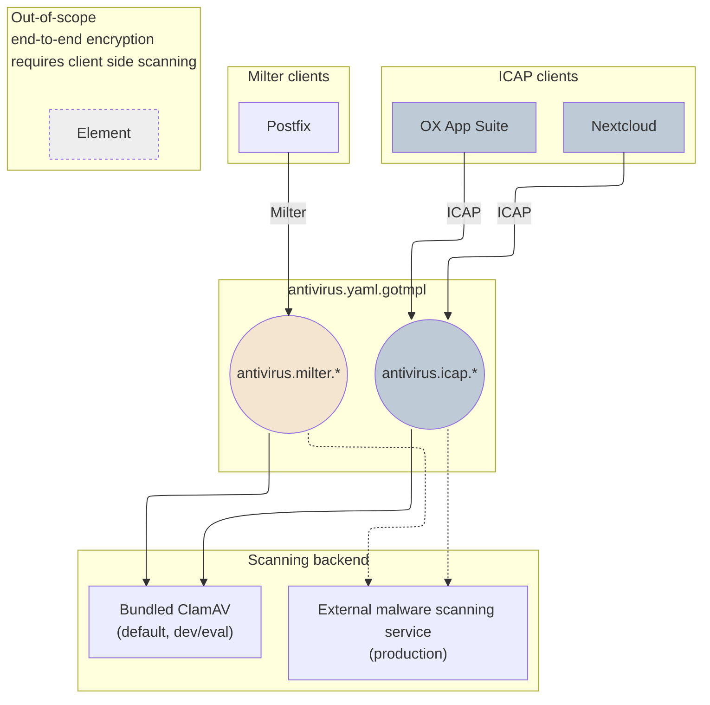

<!--
SPDX-FileCopyrightText: 2026 Zentrum für Digitale Souveränität der Öffentlichen Verwaltung (ZenDiS) GmbH
SPDX-License-Identifier: Apache-2.0
-->

# Malware protection / antivirus scanning

> [!note]
> This document addresses the BSI IT-Grundschutz module OPS.1.1.4 "Schutz vor Schadprogrammen" ("Protection Against Malware"). See the [baseline requirements](../baseline-requirements.md#it-grundschutz) for openDesk's approach towards IT-Grundschutz.

<!-- TOC -->
* [Malware protection / antivirus scanning](#malware-protection--antivirus-scanning)
  * [Overview](#overview)
    * [Architecture](#architecture)
  * [Coverage](#coverage)
    * [On detection](#on-detection)
  * [Configuration](#configuration)
    * [Pointing at an external scanning service](#pointing-at-an-external-scanning-service)
    * [Disabling scanning](#disabling-scanning)
    * [Bundled ClamAV](#bundled-clamav)
  * [Limitations](#limitations)
<!-- TOC -->

## Overview

openDesk provides a central wiring for malware/antivirus (A/V) scanning that all relevant applications connect to, rather than each application carrying its own scanner. Two protocols are used, depending on the type of consumer:

* **ICAP** ([RFC 3507](https://datatracker.ietf.org/doc/html/rfc3507)) is used by applications to scan files at upload/attachment time.
* **Milter** (mail filter) is used by the mail transfer agent (Postfix) to scan passing messages.

By default, openDesk deploys a bundled [ClamAV](https://www.clamav.net/) instance that exposes both interfaces. In production, it is intended to be replaced by an external, centrally operated malware scanning service (see [external-services.md](../external-services.md)).

### Architecture



Only one of the scanning backends is active at a time; `antivirus.icap.host` and `antivirus.milter.host` each point at either the bundled ClamAV or an external malware scanning service, as described in [Configuration](#configuration).

## Coverage

| Application  | Interface | What gets scanned                                                                                                                         |
| ------------ | --------- | ----------------------------------------------------------------------------------------------------------------------------------------- |
| Nextcloud    | ICAP      | Files uploaded to/synced into Nextcloud (also covers files edited via Collabora, saved back into Nextcloud)                               |
| OX App Suite | ICAP      | Downloads of mail/PIM attachments items opened via the AppSuite Web UI; uploads and are never scanned. See [On detection](#on-detection). |
| Postfix      | Milter    | Inbound and outbound emails by users and applications                                                                                     |

Applications that are not listed above (namely Nubus, OpenProject, XWiki, and CryptPad) do not have a central A/V scanning hook in openDesk today. Files handled exclusively within those applications are not scanned. Jitsi does not allow uploading files, and is therefore out of scope.

> [!note]
> Introducing scanning capabilities for the remaining applications is on the roadmap.
>
> Element is a deliberate exception: Files sent through Element are client-side end-to-end encrypted, so the server can never see their plaintext content. Server-side A/V scanning would therefore require breaking end-to-end encryption, which openDesk does not do. Scanning such files is only possible on the client during download, which is out of scope for openDesk.

### On detection

What happens once a scan actually flags something depends on the consumer. For the ICAP-scanned applications (Nextcloud, OX App Suite) the reaction to an infected file is decided by the application itself and is the same regardless of whether the bundled ClamAV or an external ICAP service performed the scan. For the milter-scanned mail flow (Postfix), the reaction is only under openDesk's control when the bundled ClamAV milter is used (via `antivirus.onInfected`, see [Configuration](#configuration)); an external milter-capable scanner decides for itself.

* **Nextcloud**: Infected files are deleted, and the user is notified in Nextcloud and/or by email. Uploads are also blocked outright if a file cannot be scanned at all.
  Reference: [Nextcloud antivirus scanner documentation](https://docs.nextcloud.com/server/stable/admin_manual/configuration_server/antivirus_configuration.html), [`files_antivirus` README](https://github.com/nextcloud/files_antivirus/blob/master/README.md).
* **OX App Suite**: Scanning is on-demand and download-only: the middleware only scans mail/PIM attachments (opened via the AppSuite web UI); uploads are never scanned. On detection, the download is refused with error `ANTI_VIRUS_SERVICE-0011` ("The file '...' you are trying to download seems to be infected with '...'"), but the item itself is otherwise left untouched — it is not deleted, moved, quarantined, or altered, and its owner keeps full access to it. No notification is sent to anyone (no mail, push, or admin alert), and no scan verdict is stored, so every repeated download attempt triggers a fresh scan. Removing or quarantining infected content is therefore left entirely to the operator.
  Reference: [OX Anti-Virus technical documentation](https://documentation.open-xchange.com/8/middleware/security_and_encryption/anti_virus.html).
* **Postfix**: With the bundled ClamAV milter, controlled by `antivirus.onInfected`, the mail is rejected at SMTP time with the configured message.
  Reference: [ClamAV milter `OnInfected` settings](https://manpages.debian.org/testing/clamav-milter/clamav-milter.conf.5.en.html#ACTIONS).

See the [overall architecture](../architecture.md#the-postfixes) for the wiring of Postfix within openDesk's mail flows.

## Configuration

All central A/V wiring is configured in [`antivirus.yaml.gotmpl`](../../helmfile/environments/default/antivirus.yaml.gotmpl). As with the other functional configuration files described in [functional.md](../functional.md), you override these values via your own environment values file rather than editing the defaults in place.

```yaml
antivirus:
  icap:
    host: "antivir-icap"
    port: 1344
    serviceName: "avscan"
  milter:
    host: "antivir-milter"
    port: 7357
  onInfected:
    action: "Reject"
    message: "Security scan rejected this file: %v"
```

* `antivirus.icap.host` / `antivirus.icap.port`: ICAP endpoint to be used by the ICAP clients.
* `antivirus.icap.serviceName`: ICAP service name requested by the clients (`avscan` for the bundled ClamAV/c-icap; external ICAP servers may expose a different one).
* `antivirus.milter.host` / `antivirus.milter.port`: Milter endpoint used by Postfix.
* `antivirus.onInfected.action` / `antivirus.onInfected.message`: Only applies to the bundled ClamAV milter. Controls what happens to infected mail (see [ClamAV milter `OnInfected` settings](https://manpages.debian.org/testing/clamav-milter/clamav-milter.conf.5.en.html#ACTIONS)); `%v` in the message is replaced with the virus name.

### Pointing at an external scanning service

For production use, point `antivirus.icap.host` (and `serviceName`, if different from `avscan`) at your own ICAP service. External ICAP services usually do not provide a milter interface for mail scanning, so mail scanning either stays on the bundled ClamAV milter, or `antivirus.milter.host` is separately pointed at a milter-compatible scanner.

### Disabling scanning

Set `antivirus.icap.host: ~` to disable scanning for the ICAP clients, and `antivirus.milter.host: ~` to configure no antivirus milter for mail. Both apply independently, so e.g. ICAP scanning can stay enabled while milter scanning is turned off.

### Bundled ClamAV

The bundled ClamAV is intended for development and evaluation purposes, not production use. It is available in two deployment variants, toggled via `apps.clamavSimple` and `apps.clamavDistributed` (see [`opendesk_main.yaml.gotmpl`](../../helmfile/environments/default/opendesk_main.yaml.gotmpl)):

* `clamavSimple` (default/enabled): A single-replica deployment using `ReadWriteOnce` PVCs.
* `clamavDistributed`: A scalable deployment (separate `clamd`, `freshclam`, `icap`, and `milter` components) requiring `ReadWriteMany` PVCs.

Both variants expose the scanning interfaces under the same deployment-independent service names (`antivir-icap`, `antivir-milter`), so the `antivirus.yaml.gotmpl` defaults above work regardless of which variant is enabled.

The signature databases used by the bundled ClamAV, including additional third-party malware/phishing/scam signature feeds, are configured in [`repositories.yaml.gotmpl`](../../helmfile/environments/default/repositories.yaml.gotmpl) under `repositories.clamav`.

## Limitations

* The bundled ClamAV is not intended for production use; deployments with elevated protection needs should use an operator-provided malware scanning service instead.
* Scanning only covers the applications and flows listed under [Coverage](#coverage). It does not provide malware protection for endpoints, container images, or applications without a central hook.
* OX App Suite's ICAP integration only scans on-demand downloads that explicitly request scanning, never uploads, and does not remove or quarantine infected content.
